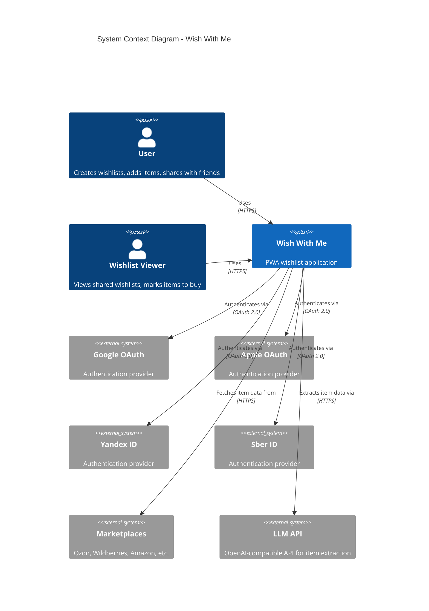
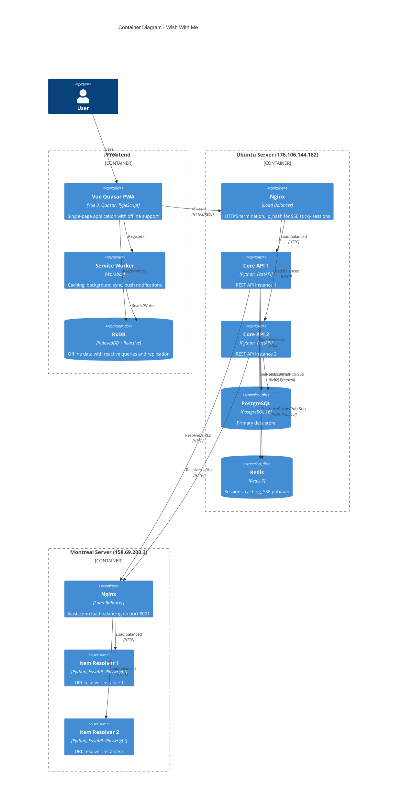
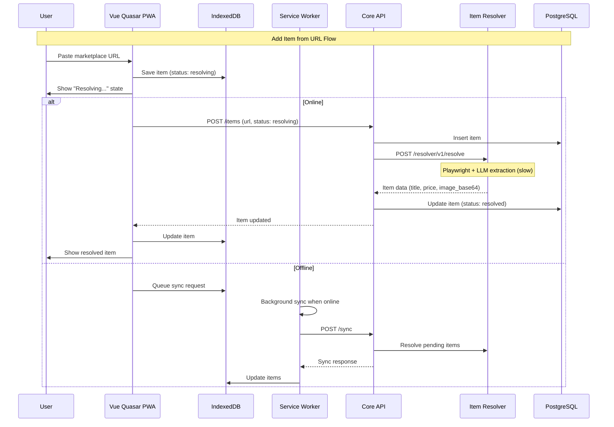

# Architecture & Technology Stack

> Part of [Wish With Me Specification](../AGENTS.md)

---

## 1. System Architecture

### 1.1 C4 Context Diagram



### 1.2 C4 Container Diagram



### 1.3 Component Interaction Flow



---

## 2. Technology Stack

### 2.1 Technology Decisions

| Layer | Technology | Version | Rationale |
|-------|------------|---------|-----------|
| **Frontend** | Vue 3 + Quasar | 2.x | Batteries-included PWA framework, excellent mobile UI |
| **Frontend Build** | Quasar CLI (Vite) | 2.x | One-command PWA generation, fast HMR |
| **PWA** | Workbox (Quasar built-in) | 7.x | Integrated service worker, precaching |
| **State Management** | Pinia | 2.x | Official Vue store, TypeScript-first, devtools |
| **Offline Storage** | RxDB | 15.x | Reactive database, real-time queries, built-in replication |
| **Backend** | FastAPI | 0.115.x | Async, automatic OpenAPI, type safety |
| **ORM** | SQLAlchemy 2.0 | 2.x | Async support, mature, PostgreSQL optimized |
| **Database** | PostgreSQL | 16.x | JSONB for flexibility, proven reliability |
| **Cache/Sessions** | Redis | 7.x | Session store, rate limiting, pub/sub for notifications |
| **Auth** | python-jose + passlib + authlib | - | JWT handling, password hashing, OAuth 2.0 clients |
| **Item Resolver** | Playwright + LLM | - | Already implemented |

### 2.2 Database Selection Rationale

**Decision**: RxDB (client) ↔ PostgreSQL (server) + Redis (cache/sessions)

**Architecture Overview**:
```
┌─────────────────────────────────────────────────────────┐
│  Browser                                                 │
│  ┌─────────────────────────────────────────────────┐    │
│  │  RxDB (IndexedDB)                               │    │
│  │  - Reactive queries (auto-updating UI)          │    │
│  │  - Offline-first data storage                   │    │
│  │  - Built-in replication protocol                │    │
│  └───────────────────┬─────────────────────────────┘    │
└──────────────────────┼──────────────────────────────────┘
                       │ HTTP replication
                       ▼
┌─────────────────────────────────────────────────────────┐
│  Backend (FastAPI)                                      │
│  ┌─────────────────────────────────────────────────┐    │
│  │  PostgreSQL                                     │    │
│  │  - ACID transactions                            │    │
│  │  - Relational integrity                         │    │
│  │  - Complex queries                              │    │
│  └─────────────────────────────────────────────────┘    │
└─────────────────────────────────────────────────────────┘
```

**Why RxDB for client-side storage**:

| Feature | RxDB | Dexie | PouchDB |
|---------|------|-------|---------|
| Reactive Queries | Native Observable | Addon | No |
| TypeScript | First-class | Good | Limited |
| Replication Protocol | Built-in | Manual | Built-in (CouchDB only) |
| Backend Flexibility | Any HTTP | Manual | CouchDB only |
| Multi-tab Support | Built-in | Manual | Manual |
| Schema Validation | JSON Schema | None | None |
| Vue Integration | @vueuse/rxjs | Manual | Manual |

**Why PostgreSQL over MongoDB/CouchDB**:

| Criteria | PostgreSQL | MongoDB | CouchDB |
|----------|------------|---------|---------|
| ACID Compliance | Full | Limited | Limited |
| JSONB Flexibility | Excellent | Native | Native |
| Relational Queries | Native | $lookup | Views |
| Operational Complexity | Low | Medium | Medium |
| Team Familiarity | High | Medium | Low |
| Multi-purpose Use | Excellent | Good | Limited |

**Redis Role**:
- JWT token blocklist (for logout/revocation)
- Session storage for OAuth state
- Rate limiting
- SSE event pub/sub (enables real-time updates across multiple core-api instances)
- In-app notification pub/sub
- Caching (item resolution results)
