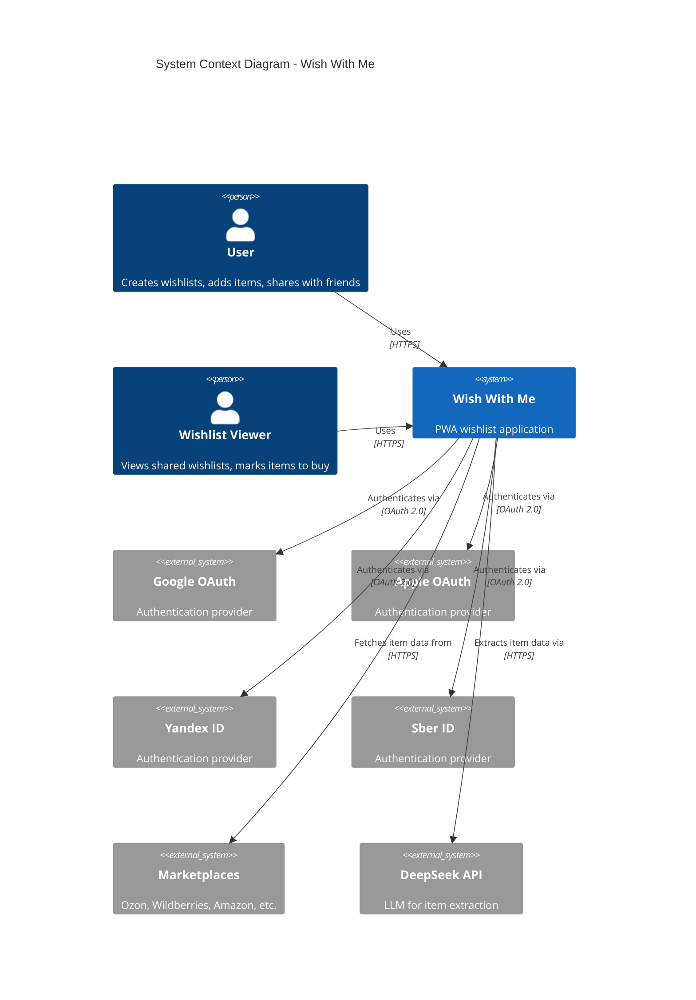
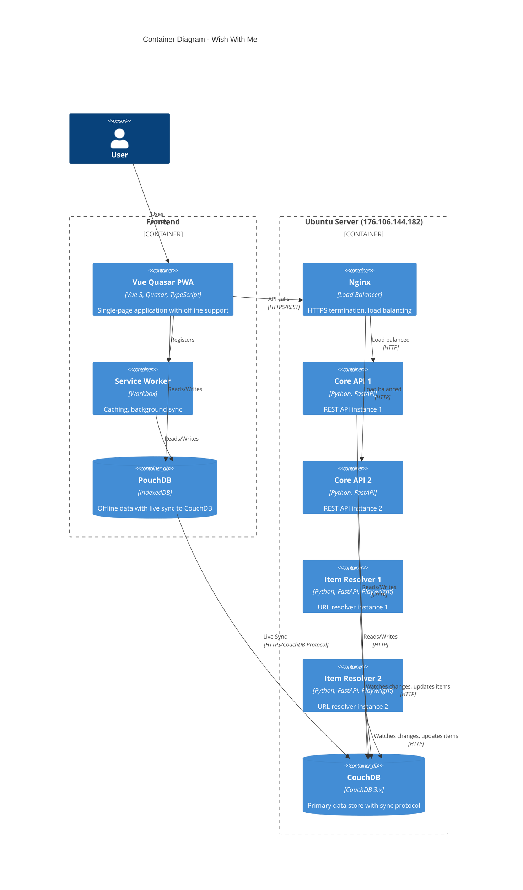
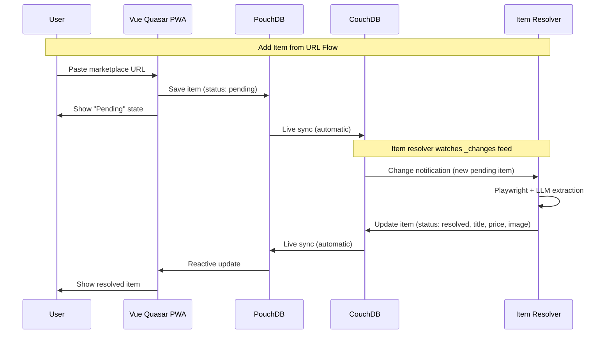
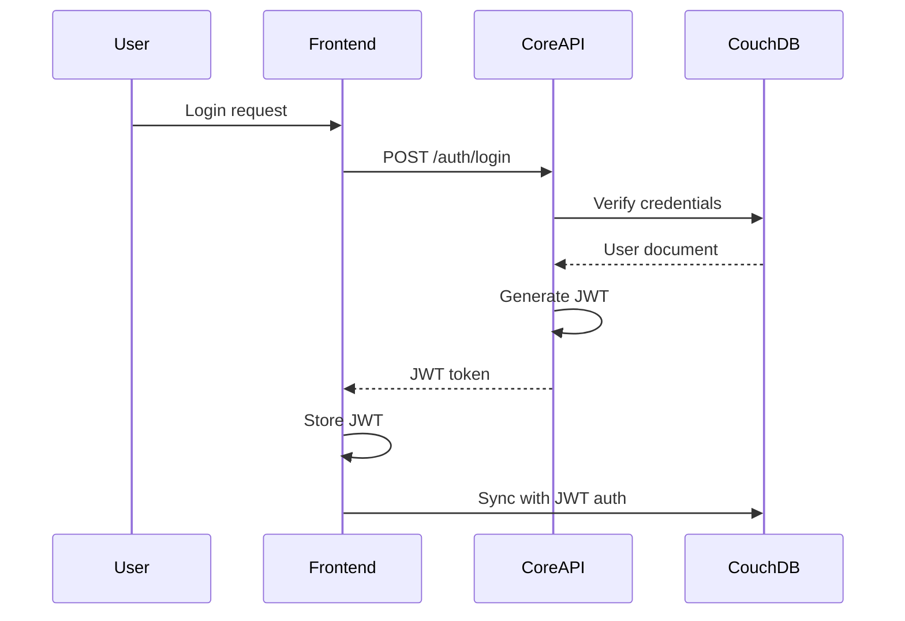
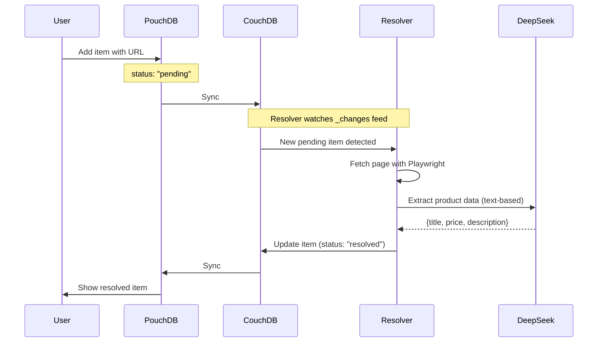

# Architecture & Technology Stack

> Part of [Wish With Me Specification](../AGENTS.md)

---

## 1. System Architecture

### 1.1 C4 Context Diagram



### 1.2 C4 Container Diagram



### 1.3 Component Interaction Flow



---

## 2. Technology Stack

### 2.1 Technology Decisions

| Layer | Technology | Version | Rationale |
|-------|------------|---------|-----------|
| **Frontend** | Vue 3 + Quasar | 2.x | Batteries-included PWA framework, excellent mobile UI |
| **Frontend Build** | Quasar CLI (Webpack) | 2.x | One-command PWA generation |
| **PWA** | Workbox (Quasar built-in) | 7.x | Integrated service worker, precaching |
| **State Management** | Pinia | 2.x | Official Vue store, TypeScript-first, devtools |
| **Offline Storage** | PouchDB | 8.x | Native CouchDB sync, offline-first, battle-tested |
| **Backend** | FastAPI | 0.115.x | Async, automatic OpenAPI, type safety |
| **Database** | CouchDB | 3.x | Native sync protocol, document-oriented, offline-first |
| **Auth** | python-jose + passlib + authlib | - | JWT handling, password hashing, OAuth 2.0 clients |
| **Item Resolver** | Playwright + DeepSeek | - | Browser automation + LLM for extraction |

### 2.2 Database Selection Rationale

**Decision**: PouchDB (client) <-> CouchDB (server) with native sync

**Architecture Overview**:
```
+-------------------------------------------------------------+
|  Browser                                                     |
|  +-----------------------------------------------------+    |
|  |  PouchDB (IndexedDB)                               |    |
|  |  - Native CouchDB sync protocol                    |    |
|  |  - Offline-first data storage                      |    |
|  |  - Live replication (real-time updates)            |    |
|  +------------------------+----------------------------+    |
+---------------------------+--------------------------------+
                            | Live sync (continuous)
                            v
+-------------------------------------------------------------+
|  Backend                                                     |
|  +-----------------------------------------------------+    |
|  |  CouchDB                                            |    |
|  |  - Document database                                |    |
|  |  - Native sync protocol                             |    |
|  |  - _changes feed for item resolver                  |    |
|  +-----------------------------------------------------+    |
+-------------------------------------------------------------+
```

**Why PouchDB + CouchDB**:

| Feature | PouchDB + CouchDB | RxDB + PostgreSQL |
|---------|-------------------|-------------------|
| Sync Protocol | Native, built-in | Custom HTTP endpoints |
| Real-time Updates | Live sync (automatic) | Requires SSE/WebSocket |
| Offline Support | First-class | Requires custom handling |
| Conflict Resolution | Built-in (revisions) | Custom implementation |
| Server Complexity | Single database | Multiple services (Postgres + Redis) |
| Multi-tab Support | Built-in | Manual coordination |

**CouchDB Role**:
- Primary data store (all documents)
- Native sync endpoint for PouchDB
- _changes feed for item resolver watching
- JWT authentication for access control

### 2.3 Real-Time Updates

**How it works**: PouchDB live sync replaces SSE/WebSockets

1. Frontend opens persistent connection to CouchDB via PouchDB sync
2. When any change occurs (local or remote), sync propagates automatically
3. PouchDB fires `change` events that update Vue reactive state
4. No polling, no SSE, no WebSocket - just native CouchDB protocol

```typescript
// Example: Live sync setup
const sync = localDB.sync(remoteDB, {
  live: true,     // Continuous sync
  retry: true     // Auto-reconnect
});

sync.on('change', (info) => {
  // UI auto-updates via reactive PouchDB queries
});
```

---

## 3. Deployment Architecture

### 3.1 Single Server Setup

All services run on Ubuntu server (176.106.144.182):

```
Internet
    |
Ubuntu Server (176.106.144.182)
+------------------------------------------------------------------+
| Nginx (443/80) - Load Balancer                                    |
|     |                                                             |
| +--------+-------------------+-------------------+---------------+|
| |        |                   |                   |               ||
| |Frontend|   Core API (2x)   |   Item Resolver   |   CouchDB     ||
| |        |   +-------------+ |   +-------------+ |   +--------+  ||
| |        |   | core-api-1  | |   | resolver-1  | |   | :5984  |  ||
| |        |   | core-api-2  | |   | resolver-2  | |   +--------+  ||
| |        |   +-------------+ |   | (DeepSeek)  | |               ||
| |        |                   |   +-------------+ |               ||
| +--------+-------------------+-------------------+---------------+|
+------------------------------------------------------------------+

Key Features:
- PouchDB syncs directly with CouchDB
- Item resolver watches CouchDB _changes feed
- No Redis, no PostgreSQL - simplified architecture
```

### 3.2 Service Communication

| Source | Destination | Protocol | Purpose |
|--------|-------------|----------|---------|
| Frontend (PouchDB) | CouchDB | HTTP/HTTPS | Live sync |
| Frontend | Core API | HTTPS/REST | Auth, sharing |
| Core API | CouchDB | HTTP | CRUD operations |
| Item Resolver | CouchDB | HTTP | Watch _changes, update items |
| Item Resolver | DeepSeek | HTTPS | LLM extraction |

---

## 4. Security Model

### 4.1 Authentication Flow



### 4.2 Access Control

CouchDB uses `access[]` arrays in documents for user-level filtering:

```javascript
// Wishlist document
{
  "_id": "wishlist:uuid",
  "type": "wishlist",
  "owner_id": "user:uuid",
  "access": ["user:owner-uuid", "user:viewer-uuid"]  // Who can see this
}
```

PouchDB sync uses filtered replication based on user's access rights.

---

## 5. Offline-First Architecture

### 5.1 Sync States

| State | Description | User Feedback |
|-------|-------------|---------------|
| Synced | All changes propagated | Green cloud icon |
| Syncing | Changes in progress | Animated cloud |
| Offline | No connection | Yellow offline banner |
| Error | Sync failed | Red error with retry |

### 5.2 Conflict Resolution

CouchDB uses revision-based conflict handling:
- Each document has `_rev` field
- Conflicts create multiple revisions
- Resolution strategy: Last-write-wins based on timestamp

---

## 6. Item Resolution Flow

### 6.1 How Item Resolver Works



### 6.2 Status Flow

```
pending -> resolving -> resolved
                    \-> failed (with retry option)
```

---

## 7. Technology Comparison (Previous vs Current)

| Aspect | Previous (RxDB + PostgreSQL) | Current (PouchDB + CouchDB) |
|--------|------------------------------|------------------------------|
| Frontend DB | RxDB | PouchDB |
| Backend DB | PostgreSQL | CouchDB |
| Cache | Redis | Not needed |
| Real-time | SSE + Redis pub/sub | Native PouchDB sync |
| Sync endpoints | Custom HTTP | Native CouchDB protocol |
| Item resolver | HTTP call to API | Watches _changes feed |
| Complexity | High (multiple services) | Low (single database) |
