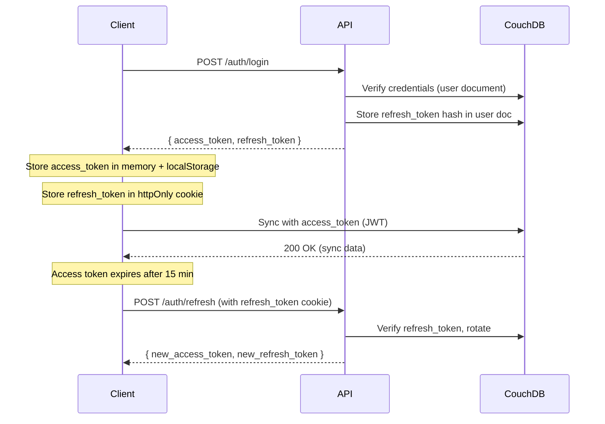

# Authentication & Security

> Part of [Wish With Me Specification](../AGENTS.md)

---

## 1. Authentication Methods

| Method | Provider | Notes |
|--------|----------|-------|
| Email/Password | Native | Min 8 characters |
| OAuth 2.0 | Google | Most common |
| OAuth 2.0 | Apple | Required for iOS |
| OAuth 2.0 | Yandex ID | Popular in Russia |
| OAuth 2.0 | Sber ID | Popular in Russia |

---

## 2. Token Strategy

### 2.1 Access Token

- **Type**: JWT
- **Expiry**: 15 minutes
- **Storage**: In-memory (Pinia store) + localStorage for persistence
- **Claims**: `sub` (user_id), `exp`, `iat`
- **CouchDB Compatible**: Used for direct CouchDB authentication

### 2.2 Refresh Token

- **Type**: Opaque random string
- **Expiry**: 30 days
- **Storage**: httpOnly cookie + hashed in CouchDB user document
- **Rotation**: New token on each refresh

### 2.3 Token Flow



### 2.4 CouchDB JWT Authentication

CouchDB natively supports JWT authentication. The JWT must contain:

```json
{
  "sub": "user:uuid-123",
  "exp": 1234567890,
  "iat": 1234567800,
  "_couchdb.roles": []
}
```

**CouchDB Configuration** (`local.ini`):
```ini
[jwt_auth]
required_claims = exp, sub
algorithms = HS256

[jwt_keys]
hmac:_default = your-256-bit-secret
```

---

## 3. OAuth Configuration

### 3.1 Google OAuth

```python
# /services/core-api/app/oauth/google.py

from authlib.integrations.starlette_client import OAuth

oauth = OAuth()

oauth.register(
    name='google',
    client_id=settings.GOOGLE_CLIENT_ID,
    client_secret=settings.GOOGLE_CLIENT_SECRET,
    server_metadata_url='https://accounts.google.com/.well-known/openid-configuration',
    client_kwargs={'scope': 'openid email profile'}
)
```

### 3.2 Apple OAuth

```python
# /services/core-api/app/oauth/apple.py

oauth.register(
    name='apple',
    client_id=settings.APPLE_CLIENT_ID,
    client_secret=settings.APPLE_CLIENT_SECRET,  # Generated JWT
    authorize_url='https://appleid.apple.com/auth/authorize',
    access_token_url='https://appleid.apple.com/auth/token',
    client_kwargs={'scope': 'name email'}
)
```

### 3.3 Yandex ID

```python
# /services/core-api/app/oauth/yandex.py

oauth.register(
    name='yandex',
    client_id=settings.YANDEX_CLIENT_ID,
    client_secret=settings.YANDEX_CLIENT_SECRET,
    authorize_url='https://oauth.yandex.ru/authorize',
    access_token_url='https://oauth.yandex.ru/token',
    userinfo_endpoint='https://login.yandex.ru/info',
    client_kwargs={'scope': 'login:email login:info login:avatar'}
)
```

### 3.4 Sber ID

```python
# /services/core-api/app/oauth/sber.py

oauth.register(
    name='sber',
    client_id=settings.SBER_CLIENT_ID,
    client_secret=settings.SBER_CLIENT_SECRET,
    authorize_url='https://online.sberbank.ru/CSAFront/oidc/authorize',
    access_token_url='https://online.sberbank.ru/CSAFront/oidc/token',
    userinfo_endpoint='https://online.sberbank.ru/CSAFront/oidc/userinfo',
    client_kwargs={'scope': 'openid name email'}
)
```

### 3.5 OAuth Auto-Link Feature

When a user logs in via OAuth with an email that matches an existing account, the system automatically links the social account to the existing user (instead of showing an error).

```python
# In OAuth callback handler
existing_user = await get_user_by_email(oauth_email)
if existing_user:
    # Link social account to existing user
    await create_social_account(
        user_id=existing_user.id,
        provider=provider,
        provider_user_id=oauth_user_id
    )
    return existing_user
else:
    # Create new user
    return await create_user_from_oauth(...)
```

---

## 4. Password Security

### 4.1 Hashing

```python
from passlib.context import CryptContext

pwd_context = CryptContext(schemes=["bcrypt"], deprecated="auto")

def hash_password(password: str) -> str:
    return pwd_context.hash(password)

def verify_password(plain: str, hashed: str) -> bool:
    return pwd_context.verify(plain, hashed)
```

### 4.2 Password Requirements

- Minimum 8 characters
- No maximum length (reasonable limit: 128)
- No complexity requirements (per NIST guidelines)
- Check against common password list

### 4.3 Password Reset

```python
# Generate reset token
import secrets
reset_token = secrets.token_urlsafe(32)

# Store hashed token in CouchDB user document with expiry (1 hour)
user_doc = await couchdb.get(f"user:{user_id}")
user_doc["password_reset_token"] = hashlib.sha256(reset_token.encode()).hexdigest()
user_doc["password_reset_expires"] = (datetime.utcnow() + timedelta(hours=1)).isoformat()
await couchdb.put(user_doc)

# Send email with reset link
reset_url = f"https://wishwith.me/password-reset/{reset_token}"
```

---

## 5. JWT Configuration

```python
# /services/core-api/app/security.py

from datetime import datetime, timedelta
from jose import jwt

SECRET_KEY = settings.JWT_SECRET_KEY  # Same as CouchDB JWT secret
ALGORITHM = "HS256"
ACCESS_TOKEN_EXPIRE_MINUTES = 15

def create_access_token(user_id: str) -> str:
    """Create JWT compatible with CouchDB authentication."""
    expire = datetime.utcnow() + timedelta(minutes=ACCESS_TOKEN_EXPIRE_MINUTES)
    to_encode = {
        "sub": user_id,  # e.g., "user:abc123"
        "exp": expire,
        "iat": datetime.utcnow(),
        "_couchdb.roles": []  # Required by CouchDB
    }
    return jwt.encode(to_encode, SECRET_KEY, algorithm=ALGORITHM)

def decode_access_token(token: str) -> dict:
    return jwt.decode(token, SECRET_KEY, algorithms=[ALGORITHM])
```

---

## 6. API Security

### 6.1 Rate Limiting

Rate limiting is implemented using in-memory storage (per instance) with slowapi:

```python
from slowapi import Limiter
from slowapi.util import get_remote_address

limiter = Limiter(key_func=get_remote_address)

@app.post("/api/v1/auth/login")
@limiter.limit("5/minute")
async def login(request: Request, credentials: LoginRequest):
    ...

@app.post("/api/v1/auth/register")
@limiter.limit("3/minute")
async def register(request: Request, data: RegisterRequest):
    ...
```

**Note**: With multiple core-api instances, each maintains its own rate limit counters. This is acceptable for basic protection.

### 6.2 CORS Configuration

```python
from fastapi.middleware.cors import CORSMiddleware

app.add_middleware(
    CORSMiddleware,
    allow_origins=[
        "https://wishwith.me",
        "https://www.wishwith.me",
        "http://localhost:9000"  # Dev only
    ],
    allow_credentials=True,
    allow_methods=["GET", "POST", "PUT", "PATCH", "DELETE"],
    allow_headers=["Authorization", "Content-Type"],
)
```

### 6.3 Security Headers

```python
from starlette.middleware import Middleware
from starlette.middleware.base import BaseHTTPMiddleware

class SecurityHeadersMiddleware(BaseHTTPMiddleware):
    async def dispatch(self, request, call_next):
        response = await call_next(request)
        response.headers["X-Content-Type-Options"] = "nosniff"
        response.headers["X-Frame-Options"] = "DENY"
        response.headers["X-XSS-Protection"] = "1; mode=block"
        response.headers["Strict-Transport-Security"] = "max-age=31536000; includeSubDomains"
        return response
```

---

## 7. Authorization

### 7.1 Access Control via Document Access Arrays

CouchDB documents use `access[]` arrays to control who can read/write:

```javascript
{
  "_id": "wishlist:abc123",
  "access": ["user:owner-id", "user:viewer-id"]
}
```

PouchDB filtered replication ensures users only sync documents they have access to.

### 7.2 Wishlist Access Rules

| Role | View | Edit | Delete | Mark |
|------|------|------|--------|------|
| Owner | Yes | Yes | Yes | No |
| Viewer (via share link) | Yes | No | No | Yes |
| Non-authenticated | No | No | No | No |

### 7.3 Surprise Mode

Wishlist owners MUST NOT see:
- `marked_quantity` on items
- Who marked items
- Mark timestamps

```python
def serialize_item(item: dict, is_owner: bool) -> dict:
    if is_owner:
        # Hide marking info from owner (surprise mode)
        item.pop('marked_quantity', None)
    return item
```

Mark documents have `access[]` arrays that exclude the wishlist owner:

```javascript
{
  "_id": "mark:xyz789",
  "type": "mark",
  "item_id": "item:abc123",
  "owner_id": "user:wishlist-owner",  // For reference only
  "marked_by": "user:viewer-id",
  "access": ["user:viewer-id"]  // Owner NOT included
}
```

---

## 8. Environment Variables

```bash
# Authentication
JWT_SECRET_KEY=your-secret-key-min-32-chars  # Same for API and CouchDB
JWT_ALGORITHM=HS256
ACCESS_TOKEN_EXPIRE_MINUTES=15
REFRESH_TOKEN_EXPIRE_DAYS=30

# OAuth - Google
GOOGLE_CLIENT_ID=xxx.apps.googleusercontent.com
GOOGLE_CLIENT_SECRET=xxx

# OAuth - Apple
APPLE_CLIENT_ID=com.wishwithme.app
APPLE_TEAM_ID=xxx
APPLE_KEY_ID=xxx
APPLE_PRIVATE_KEY_PATH=/secrets/apple.p8

# OAuth - Yandex
YANDEX_CLIENT_ID=xxx
YANDEX_CLIENT_SECRET=xxx

# OAuth - Sber
SBER_CLIENT_ID=xxx
SBER_CLIENT_SECRET=xxx

# CouchDB
COUCHDB_URL=http://couchdb:5984
COUCHDB_DATABASE=wishwithme
COUCHDB_ADMIN_USER=admin
COUCHDB_ADMIN_PASSWORD=xxx
```

---

## 9. Token Revocation

Without Redis, token revocation is handled by:

1. **Short-lived access tokens** (15 minutes) - natural expiration
2. **Refresh token rotation** - old tokens become invalid
3. **On logout** - Clear client-side storage, delete refresh token from user document

```python
async def logout(user_id: str):
    # Remove refresh token from user document
    user_doc = await couchdb.get(f"user:{user_id}")
    user_doc["refresh_token_hash"] = None
    await couchdb.put(user_doc)

    # Clear client-side: frontend destroys PouchDB and clears localStorage
```

For forced token revocation (e.g., password change), the user document can store a `tokens_valid_after` timestamp. JWTs issued before this time are rejected.
