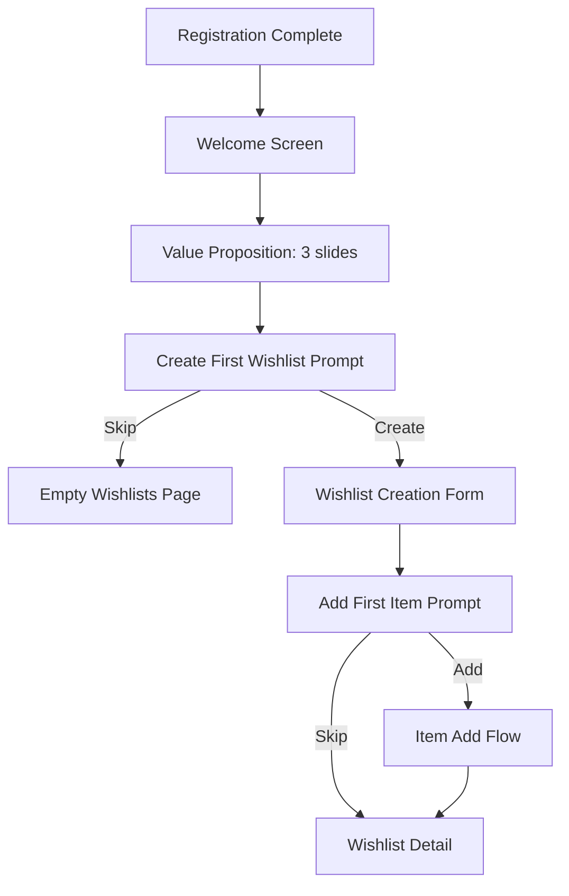
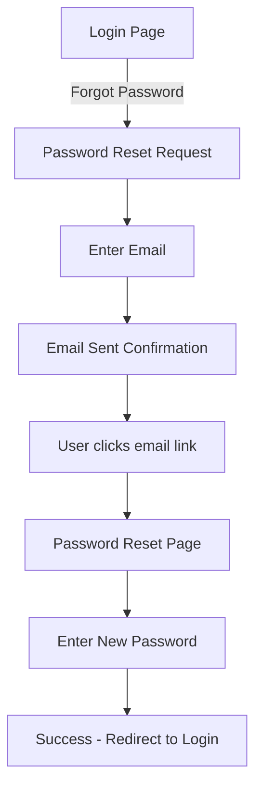
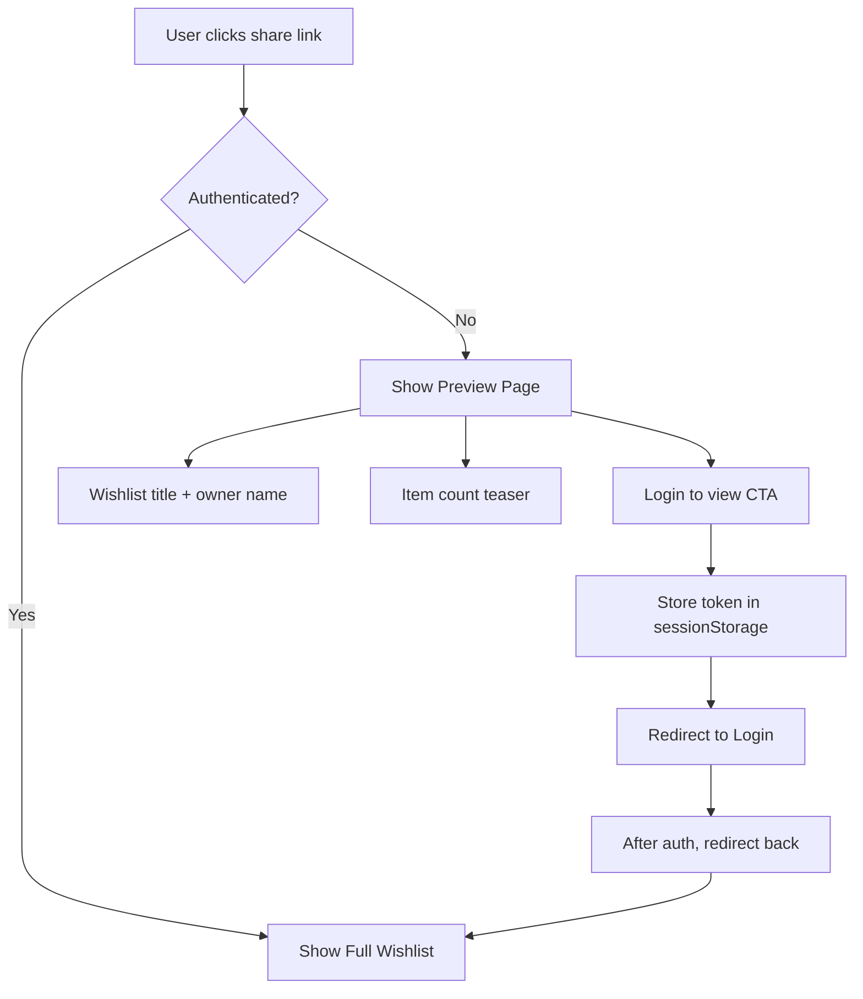

# UI/UX Specification

> Part of [Wish With Me Specification](../AGENTS.md)

---

## 1. User Flows

### 1.1 First-Time User Onboarding



**Onboarding Screens**:

| Screen | Content |
|--------|---------|
| Welcome 1 | "Create wishlists for any occasion" + gift illustration |
| Welcome 2 | "Share with friends and family" + sharing illustration |
| Welcome 3 | "Keep the surprise - they won't see what's marked" + surprise illustration |

**Skip Logic**: Users can skip at any point, progress indicators show step count.

### 1.2 Password Reset Flow



**Pages Required**:
- `/password-reset` - Email input form
- `/password-reset/:token` - New password form

### 1.3 Share Link Reception (Unauthenticated)



### 1.4 Account Linking Flow

Settings page section for managing connected accounts:

```
Connected Accounts
├── Google: john@gmail.com ────────── [Disconnect]
├── Apple: Not connected ─────────── [Connect]
├── Yandex ID: Not connected ──────── [Connect]
└── Sber ID: Not connected ────────── [Connect]
```

**Rules**:
- Cannot disconnect last login method
- Show confirmation dialog before disconnect
- Display linked email for each provider

---

## 2. Information Architecture

### 2.1 Complete Page Structure

```
/ (IndexPage)
├── /login
├── /register
├── /password-reset
├── /password-reset/:token
├── /auth/callback/:provider
│
├── /wishlists (list)
│   ├── /wishlists/:id (detail)
│   ├── /wishlists/:id/edit
│   └── /wishlists/:id/items/:itemId (item detail overlay)
│
├── /s/:token (shared wishlist - authenticated)
├── /s/:token/preview (shared wishlist - unauthenticated preview)
│
├── /profile
├── /settings
│   ├── /settings/account
│   ├── /settings/connected-accounts
│   └── /settings/notifications
│
├── /u/:slug (public profile)
├── /notifications (full page)
└── /help (FAQ)
```

### 2.2 Navigation Structure

**Desktop (md+)**: Top navigation bar
```
[Logo] [Wishlists] [Notifications Bell] [Profile Avatar ▼]
```

**Mobile (xs, sm)**: Bottom navigation bar
```
┌─────────────────────────────────────────────┐
│  🏠     📋      ➕      🔔      👤         │
│ Home  Lists   Add   Alerts  Profile        │
└─────────────────────────────────────────────┘
```

**Add Button Action Sheet** (mobile center button):
- "Create new wishlist"
- "Add item from URL"

---

## 3. Component Specifications

### 3.1 ItemCard Component

**Purpose**: Display item information in wishlist view

**Variants**:

| Variant | Use Case | Features |
|---------|----------|----------|
| Owner view | Viewing own wishlist | Edit/delete actions, no mark info |
| Viewer view | Viewing shared wishlist | Mark button, marked count |
| Compact | Mobile list | Minimal info, thumbnail |
| Expanded | Detail view | Full description, larger image |

**States**:

| State | Visual Treatment | Content |
|-------|------------------|---------|
| Pending | Skeleton shimmer | "Waiting to resolve" |
| Resolving | Animated shimmer | "Loading item details..." |
| Resolved | Full display | All item data |
| Failed | Error icon, red border | Error message, Retry button |
| Manual | Normal display | "Added manually" label (subtle) |

**Skeleton Loading**:
```
┌─────────────────────────────────────────┐
│ ╔═══════════╗ │ ████████████████████   │
│ ║           ║ │ ████████████████████   │
│ ║  (image)  ║ │ ████████               │
│ ║           ║ │ ████████ ████████      │
│ ╚═══════════╝ │                        │
└─────────────────────────────────────────┘
```

### 3.2 MarkButton Component

**States**:

| State | Label (RU) | Label (EN) | Color | Icon |
|-------|------------|------------|-------|------|
| Available | Отметить | Mark | positive | check |
| Partially available | Отметить (осталось 2) | Mark (2 left) | positive | check |
| Fully marked | Всё отмечено | All marked | muted | check-circle |
| Marked by me | Снять отметку | Unmark | negative | x |
| Disabled (owner) | Ваш товар | Your item | disabled | - |

**Partial Quantity Interaction**:
1. Tap "Mark" opens bottom sheet
2. Show quantity selector: "Сколько вы возьмёте?" / "How many will you get?"
3. Stepper: `[ - ] 1 [ + ]` (max: available quantity)
4. Confirm button

### 3.3 OfflineBanner Component

**Position**: Fixed at bottom, above bottom nav

**States**:

| State | Message (RU) | Message (EN) | Color | Action |
|-------|--------------|--------------|-------|--------|
| Offline | Нет подключения | You're offline | warning (amber) | None |
| Syncing | Синхронизация... | Syncing... | info (blue) | Spinner |
| Sync error | Ошибка синхронизации | Couldn't sync | negative (red) | [Retry] |
| Back online | Подключение восстановлено | Back online! | positive (green) | Auto-dismiss 3s |

### 3.4 SyncStatus Component (Header)

**Position**: Header, next to notification bell

**States**:

| State | Icon | Badge |
|-------|------|-------|
| Synced | cloud-check | None |
| Pending | cloud-arrow-up | Number of pending |
| Syncing | cloud (animated) | None |
| Error | cloud-x | ! |

**Tooltip**: "3 изменения ожидают синхронизации" / "3 changes waiting to sync"

---

## 4. Empty States

### 4.1 Wishlists Page (no wishlists)

```
     ┌─────────────┐
     │   🎁 ✨    │
     └─────────────┘

Здесь появятся ваши списки желаний
Your wishlists will appear here

Создайте первый список, чтобы начать добавлять товары
Create your first wishlist to start adding items

        [Создать список]
        [Create Wishlist]
```

### 4.2 Wishlist Detail (no items)

```
     ┌─────────────┐
     │   📝 ✨    │
     └─────────────┘

Этот список пока пуст
This wishlist is empty

Добавьте товары, вставив ссылку или вручную
Add items by pasting a link or manually

        [Добавить товар]
        [Add Item]
```

### 4.3 Shared Wishlist (all marked)

```
     ┌─────────────┐
     │   🎉 🎊    │
     └─────────────┘

Все товары отмечены!
All items have been marked!

Загляните позже — возможно, будут добавлены новые
Check back later — more items might be added
```

### 4.4 Notifications (none)

```
     ┌─────────────┐
     │   🔔 💤    │
     └─────────────┘

Пока нет уведомлений
No notifications yet

Здесь вы увидите обновления по вашим спискам
You'll see updates about your wishlists here
```

### 4.5 Search Results (no matches)

```
     ┌─────────────┐
     │   🔍 ❓    │
     └─────────────┘

Ничего не найдено
No items found

Попробуйте другой запрос
Try a different search term
```

---

## 5. Mobile-Specific UX

### 5.1 Pull-to-Refresh

| Page | Action |
|------|--------|
| Wishlists | Refresh list + trigger sync |
| Wishlist detail | Refresh items + trigger sync |
| Shared wishlist | Refresh to see latest marks |
| Notifications | Refresh notifications |

### 5.2 Swipe Actions

**Wishlist Card**:
- Swipe left → Delete (with confirmation)
- Swipe right → Share

**Item Card (Owner)**:
- Swipe left → Delete (with confirmation)
- Swipe right → Edit

**Item Card (Viewer)**:
- Swipe right → Quick mark (if available)

### 5.3 Touch Targets

All interactive elements must meet minimum 44x44px touch target.

```scss
// quasar.variables.sass
$button-min-height: 44px
$input-min-height: 48px
$list-item-min-height: 48px
```

---

## 6. Accessibility

### 6.1 Screen Reader Announcements

```vue
<!-- Item resolution status -->
<div aria-live="polite" class="sr-only">
  {{ itemResolved ? `Товар ${item.title} загружен` : '' }}
</div>

<!-- Sync status -->
<div aria-live="polite" class="sr-only">
  {{ isSyncing ? 'Синхронизация изменений' : '' }}
  {{ syncComplete ? 'Все изменения сохранены' : '' }}
</div>

<!-- Mark action -->
<div aria-live="assertive" class="sr-only">
  {{ justMarked ? `Товар ${item.title} отмечен` : '' }}
</div>
```

### 6.2 Keyboard Navigation

| Action | Key |
|--------|-----|
| Open wishlist | Enter |
| Mark/unmark item | Enter or Space |
| Open item menu | Context menu or Shift+F10 |
| Delete item | Delete (with focus) |
| Navigate items | Arrow keys |
| Close dialog | Escape |

### 6.3 Focus Management

| Event | Focus Moves To |
|-------|----------------|
| Create wishlist | Wishlist title |
| Add item | New item |
| Delete item | Next item or "Add item" button |
| Open dialog | First focusable element |
| Close dialog | Trigger element |
| Navigate | Main content (skip nav) |

### 6.4 Color Contrast Fixes

Current issues and fixes:

| Color | Current | Issue | Fix |
|-------|---------|-------|-----|
| Positive | #21BA45 | 3.1:1 contrast | Change to #1a9f38 |
| Warning | #F2C037 | 1.7:1 contrast | Use dark text on yellow |

```scss
// Updated brand colors
$positive: #1a9f38  // Darkened for contrast
$warning: #F2C037   // Keep, but use dark text

// Warning text rule
.bg-warning {
  color: $dark !important;
}
```

### 6.5 Reduced Motion

```scss
@media (prefers-reduced-motion: reduce) {
  *, *::before, *::after {
    animation-duration: 0.01ms !important;
    animation-iteration-count: 1 !important;
    transition-duration: 0.01ms !important;
  }
}
```

---

## 7. Error States

### 7.1 Network Error (Global)

- **Trigger**: API unreachable
- **Display**: Full-screen overlay with retry
- **Message**: "Соединение потеряно" / "Connection lost"
- **Action**: [Retry] button + automatic switch to offline mode

### 7.2 Authentication Error

- **Trigger**: 401 response
- **Display**: Redirect to login with message
- **Message**: "Сессия истекла, войдите снова" / "Session expired, please log in again"
- **Store**: Clear tokens, preserve redirect URL

### 7.3 Item Resolution Errors

| Error | Message (RU) | Message (EN) | Action |
|-------|--------------|--------------|--------|
| TIMEOUT | Страница загружалась слишком долго | Page took too long to load | [Retry] |
| BLOCKED | Сайт заблокировал доступ | Site blocked our access | [Edit manually] |
| PARSE_FAILED | Не удалось получить данные | Couldn't extract item details | [Edit manually] |
| INVALID_URL | Неверный формат ссылки | Invalid URL format | [Edit manually] |

### 7.4 Form Validation

- Display inline below each field
- Color: negative
- Clear on field focus or correction
- Link error to field via aria-describedby

### 7.5 Rate Limit Error

- **Trigger**: 429 response
- **Display**: Toast notification
- **Message**: "Слишком много запросов. Подождите немного." / "Too many requests. Please wait."
- **Action**: Disable button with countdown

---

## 8. Micro-Interactions

### 8.1 Haptic Feedback (Mobile)

| Action | Vibration Pattern |
|--------|-------------------|
| Mark item | Short (10ms) |
| Unmark item | Short (10ms) |
| Delete confirm | Medium (50ms) |
| Error | Double short |

### 8.2 Visual Feedback

| Action | Animation |
|--------|-----------|
| Item added | Slide in from right |
| Item deleted | Fade out + collapse |
| Wishlist created | Scale up bounce |
| Share link copied | Checkmark appear |
| Pull-to-refresh | Rubber band + spinner |
| Sync complete | Subtle checkmark flash |

### 8.3 Loading States

| Context | Treatment |
|---------|-----------|
| Page load | Full skeleton |
| Action pending | Button spinner + disable |
| Infinite scroll | Bottom spinner |
| Item resolving | Shimmer animation on card |

---

## 9. i18n Considerations

### 9.1 Russian Pluralization

Russian has three plural forms (one/few/many):

```typescript
// Example usage in vue-i18n
{
  "items": {
    "count_one": "{count} товар",      // 1, 21, 31...
    "count_few": "{count} товара",     // 2-4, 22-24...
    "count_many": "{count} товаров"    // 0, 5-20, 25-30...
  }
}
```

### 9.2 Date/Time Formatting

```typescript
export function formatDate(date: string | Date, locale: string): string {
  return new Intl.DateTimeFormat(locale, {
    day: 'numeric',
    month: 'long',
    year: 'numeric'
  }).format(new Date(date));
}

// ru: "21 января 2026 г."
// en: "January 21, 2026"
```

### 9.3 Currency Formatting

```typescript
export function formatPrice(amount: number, currency: string, locale: string): string {
  return new Intl.NumberFormat(locale, {
    style: 'currency',
    currency: currency,
    minimumFractionDigits: 0,
    maximumFractionDigits: 2
  }).format(amount);
}

// ru: "5 990 ₽"
// en: "₽5,990"
```

### 9.4 RTL Future-Proofing

Use logical CSS properties:

```scss
// Instead of:
margin-left: 8px;
// Use:
margin-inline-start: 8px;

// Instead of:
text-align: left;
// Use:
text-align: start;

// Instead of:
padding-right: 16px;
// Use:
padding-inline-end: 16px;
```

---

## 10. Additional Features

### 10.1 Wishlist Templates

Pre-made templates for common occasions:

| Template | Default Title (RU) | Default Title (EN) |
|----------|--------------------|--------------------|
| Birthday | День рождения | Birthday |
| Wedding | Свадьба | Wedding |
| Baby Shower | Для малыша | Baby Shower |
| New Year | Новый год | New Year |
| Housewarming | Новоселье | Housewarming |

### 10.2 Search & Filter

**Search**: Search items within wishlists by title

**Sort Options**:
- Date added (newest/oldest)
- Price (high/low)
- Name (A-Z/Z-A)

**Filter Options**:
- All items
- Available only
- Marked by me

### 10.3 Undo for Destructive Actions

Implement 5-second undo window for:
- Wishlist deletion
- Item deletion
- Unmark action

```typescript
Notify.create({
  message: 'Товар удалён',
  actions: [{ label: 'Отменить', handler: undoDelete }],
  timeout: 5000
})
```

---

## 11. Implementation Priority

### High Priority (Before Launch)
1. ✅ Password reset flow
2. ✅ Pre-auth share link preview
3. ✅ Empty states for all contexts
4. ✅ Color contrast fixes
5. ✅ Offline action feedback
6. ✅ Bottom navigation for mobile

### Medium Priority (V1.1)
1. First-time onboarding
2. Item detail view
3. Search functionality
4. Component state specifications
5. Undo for destructive actions
6. Sort/filter UI

### Low Priority (V1.2+)
1. Wishlist templates
2. FAQ/help page
3. Analytics event definitions
4. RTL language support
